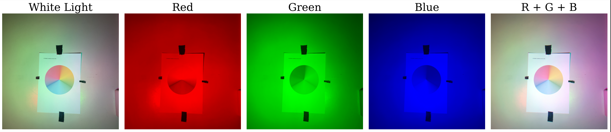

# color-addition

Data Analysis for Physics 192 Color Addition Experiment

We took an image of a color wheel under the illumination of the three primary colors 🔴🟢🔵. Then, we use OpenCV in Python to synthetically reproduce a set of colored images and compared it with the raw image.

